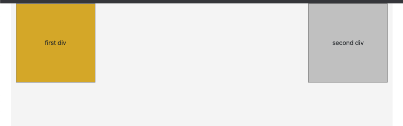
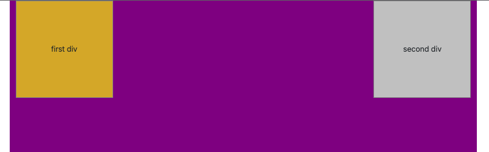
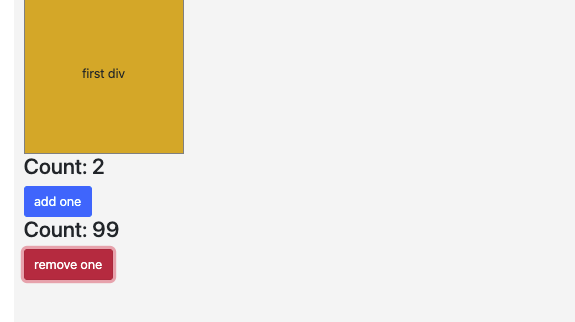

# LAP 3 Day 1 - Afternoon class - USING HOOK,STATE, BUILDING COUNTER + simple testing

- tidy up index.js (remove some useless extra folders)
- add fragment 

- `npm start` 
- build to divs within fragment
- install bootstrap 
 `npm install react-bootstrap bootstrap`
- add to App.js 
 `import 'bootstrap/dist/css/bootstrap.min.css';`
- create and add App.css
- connect App.css to App.js `import './App.css';`

Add event (Mouse Events)
- ` 
 console.log('do something')}>first div
` - when we hover over div one we can see 'do something' in console
- trasnfer it into function 

Change background:
- ` 
`

Add state:
- add state 
- change initial backgground color
- when hove over div 1 change background to red and back to initial one
- hover over each div changes bcC 

Convention
- on Element Event (onInpiutclick)

# Counter
- create Counter.js and connect to App.js
- create Event (when clicked we will have value) `onBtnClick` we can use alco `handleBtnClick` (handle is limited to single use) or `increaseCount`
- make another red button that removes one from 100

# Testing
- play with testing library [rtl](https://testing-library.com/docs/react-testing-library/intro/)

- CRA – Create React App
- SPA – Single Page Application

- Non- CRA Setup:
-`npm install --save-dev jest babel-jest @testing-library/react @testing-library/jest-dom @testing-library/user-event`
 - follow steps from gitHub wiki futureproof testing with React [link](https://github.com/getfutureproof/fp_guides_wiki/wiki/Testing-React:-Jest-and-React-Testing-Library)
